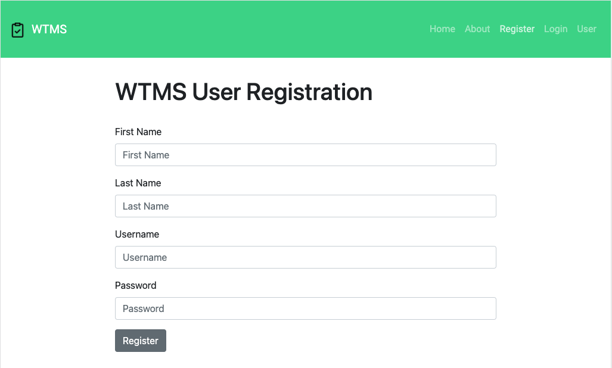
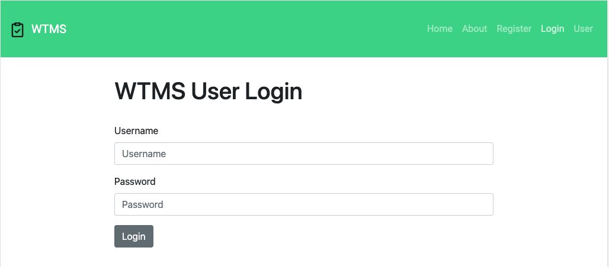
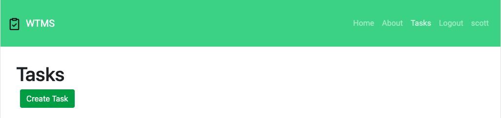
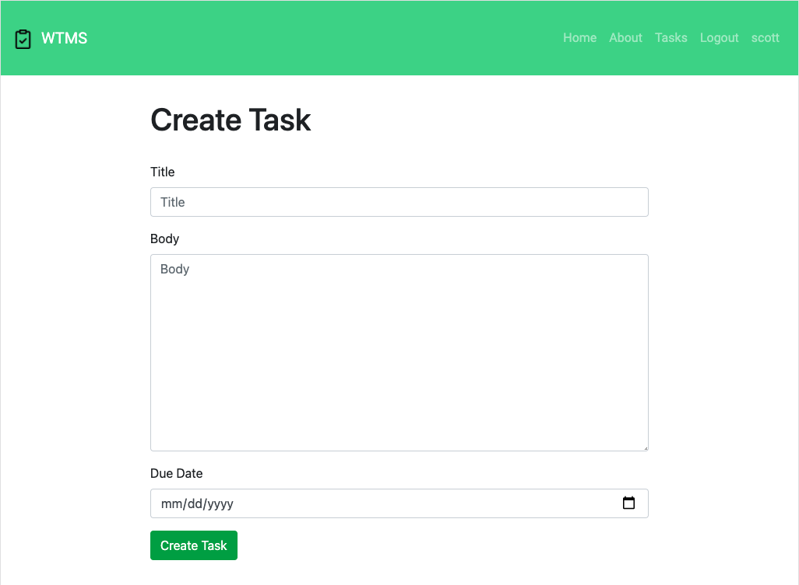
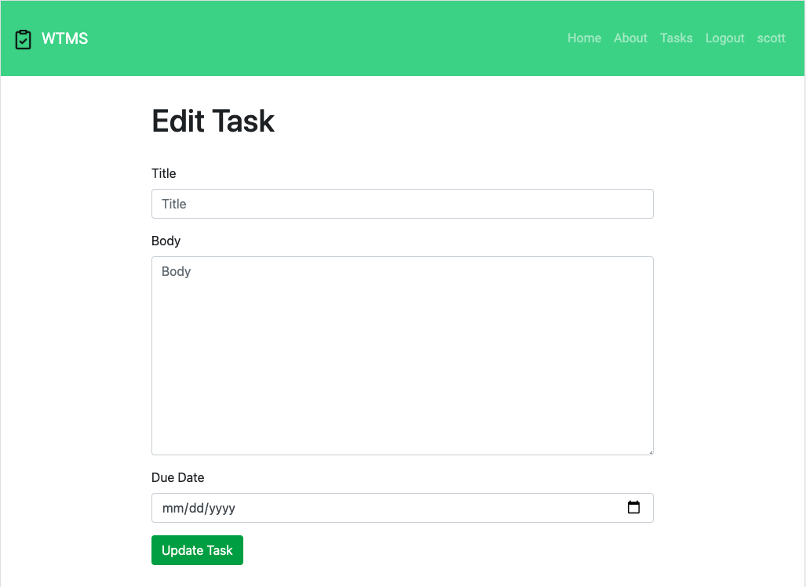
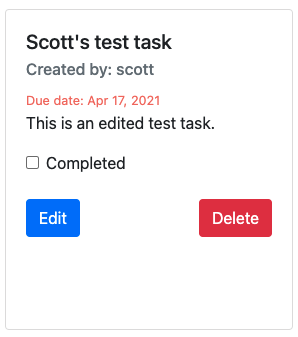
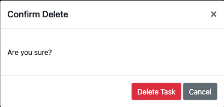

# Web Task Management System (WTMS)
WTMS is a web based task management application that a team of developers could utilize to create, edit, track the completion of, and delete tasks as part of a workgroup. 

- [Web Task Management System (WTMS)](#web-task-management-system-wtms)
  - [Project Motivation](#project-motivation)
  - [Project setup](#project-setup)
    - [Running the Application (local environment)](#running-the-application-local-environment)
  - [Working with the MongoDB Database](#working-with-the-mongodb-database)
  - [Navigation and Use](#navigation-and-use)
    - [Registration and Login](#registration-and-login)
    - [Tasks View](#tasks-view)
    - [Task Creation](#task-creation)
    - [Task Edit and Completion](#task-edit-and-completion)
    - [Task Deletion](#task-deletion)
  - [Development Notes](#development-notes)
    - [MongoDB](#mongodb)
    - [Incorporating Bootstrap](#incorporating-bootstrap)
    - [Adding `styles.css`](#adding-stylescss)

## Project Motivation
WTMS is the project chosen for use as a means of applying the concepts learned in the East Carolina University (ECU) CSCI 6600 *Database Management System* course.

## Project setup
### Running the Application (local environment)
**Start MongoDB:**
```bash
mongod --dbpath=/System/Volumes/Data/data/db
```
**Notes:** 
* Addressed mongo's `data/db` error via the steps in *Tolumide's* answer on [this StackOverflow discussion](https://stackoverflow.com/questions/58283257/mongodb-cant-find-data-directory-after-upgrading-to-mac-os-10-15-catalina).
* The `Address already in use` error can be corrected by running:
  ```bash
  ps aux | grep -v grep | grep mongod
  ```
  to find the PID followed by:
  ```bash
  kill -9 <PID>
  ```
  to end the running process at the address.

**Start the server:**
```bash
npm run dev
```

**Start the client:**
```bash
npm run serve
```
## Working with the MongoDB Database
To access the MongoDB database:
```bash
sudo mongo
```
Show MongoDB databases:
```bash
show dbs
```
Switch to the database:
```bash
use wtms-db
```
List the current database users:
```bash
db.users.find().pretty()
```
## Navigation and Use
### Registration and Login
New users can register via the **Register** link.  Form inputs for first and last name, username, and password are presented.  Once registered, user is directed back to the homepage.


<br>

Existing users can login via the **Login** link.  Form inputs for username and password are presented.  Once registered, user is directed back to the homepage. 



### Tasks View
Authenticated users can view tasks, and the **Create Task** button allows a user to create a new task by taking them to the create task form.



### Task Creation
Form inputs for title, body, and due date are presented.  Selecting the **Create Task** button creates the new task in the database and shows it in the Tasks view page.



### Task Edit and Completion
Form inputs for updating the title, body, and due date are presented.  Selecting the **Update Task** button updates the task in the database and on the Tasks view page.



<br>

The task’s **Completed** check box can be selected to indicate completion.  If the task is past due, the date will format to a red color indicating that it’s late.



### Task Deletion
If a user selects a task’s **Delete** button a modal is displayed for confirmation.  Selecting the modal’s **Delete Task** button removes it from the database and the Tasks view page.



## Development Notes
### MongoDB
Start MongoDB with:
```bash
brew services start mongodb-community@4.4
```
Verify that MongoDB is running with:
```bash
brew services list
```
Stop MongoDB with:
```bash
brew services stop mongodb-community@4.4
```
Once MongoDB is running, enter MongoDB shell with (in a new terminal window):
```bash
mongo
```
### Incorporating Bootstrap
Incorporate bootstrap css via:
```bash
npm install bootstrap --save
```
and then installed peer dependencies via (after referencing [this StackOverflow discussion](https://stackoverflow.com/questions/46053414/npm-warn-requires-a-peer-of-but-none-is-installed-you-must-install-peer)):
```bash
npm install --save "jquery@1.9.1 - 3"
```
```bash
npm install --save "popper.js@^1.16.1"
```
Finally, incorporated them into `main.js` by (after referencing [this StackOverflow discussion](https://stackoverflow.com/questions/42684661/adding-bootstrap-to-vue-cli-project)):
```javascript
import 'bootstrap/dist/css/bootstrap.min.css'
import 'jquery/src/jquery.js'
import 'bootstrap/dist/js/bootstrap.min.js'
```
### Adding `styles.css`
Incorporated the self created `styles.css` by adding
```javascript
@import './assets/css/style.css'; 
```
to `App.vue` (after referencing [this StackOverflow discussion](https://stackoverflow.com/questions/43784202/how-to-include-css-files-in-vue-2).
